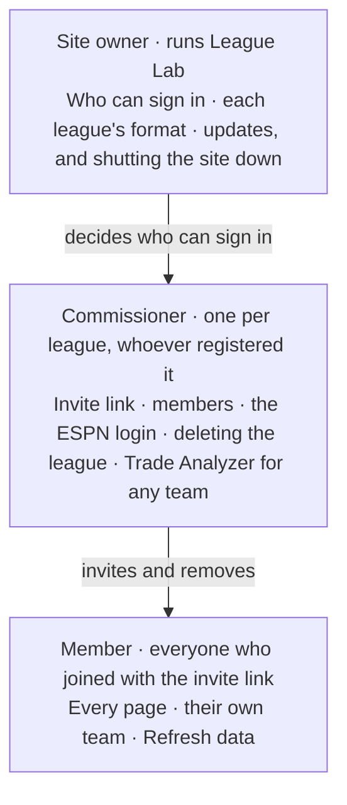

# Commissioners on League Lab

*October 7, 2026.*

## What a commissioner is

A league's commissioner on League Lab is the person who registered it there: registering
a league makes you its commissioner, and everyone who comes in through its invite link
joins as a member.

- **It's a League Lab role, not ESPN's.** Any manager in the league can register it and
  be its commissioner here, and the role gives no control over the league on ESPN.
  League Lab only reads ESPN; it never changes anything there.
- **One per league.** The role can't be handed to someone else on the site; that takes
  the site owner.
- **Also a member.** The commissioner claims a team and sees every page like everyone
  else, plus the controls below.

Each role sits under the one above it: the site owner's sign-in list decides who can
register or join at all, and a commissioner decides who's in their league.

## Powers at a glance

The commissioner has six controls members don't; all but one live on the League
settings page.

| Power | Where | What it does |
| --- | --- | --- |
| Create or replace the invite link | League settings | The only way in for new members; replacing it stops the old link working |
| See every member | League settings | Each member's name, the team they claimed and their role |
| Remove a member | League settings | Takes them out of the league on League Lab and frees their team |
| Manage the league's ESPN login | League settings | Connect, replace or remove the login a private league is read with |
| Delete the league | League settings | Removes the league, its data and every membership for everyone |
| Trade Analyzer for any team | Trade Analyzer | Recommendations from any team's side; members only get their own |

Members who open League settings see only their own team and the note "Only the
league's commissioner on League Lab can invite people or delete it."

## The invite link

Members can only join through the league's invite link, which the commissioner shares.
One is made when the league is registered, and it looks like `…/join?code=…`.

How someone joins:

1. The commissioner copies the link from League settings and sends it to them.
2. They sign in with Google first. Only accounts on the site's sign-in list can sign in
   at all.
3. They open the link, or paste the link or its code on the Join a league page.
4. They pick their team from the ones nobody has claimed, or choose "I don't have a
   team (just looking)".
5. The league appears in their sidebar's League picker.

- **Replace invite link** makes a new link and stops the old one working at once. People
  already in the league stay in.
- Anyone holding the current link can join, so share it only with the league. If it
  leaks, replace it.
- No one can join twice, and a league still loading its first data can't be joined
  until it finishes (a few minutes).

## Managing members

The commissioner sees every member and can remove anyone but themselves.

- **The list** shows each member's name, the team they claimed (or "no team") and their
  role.
- **Remove** takes a member out of the league on League Lab at once. They lose its
  pages, and their team is free to claim again. Coming back takes the invite link.
- **One person per team.** A team someone has claimed isn't offered to anyone else, so a
  wrong claim blocks the real manager until the commissioner removes it.
- **No Leave button.** A member who wants out asks the commissioner to remove them.
- **Own team only.** Members change their own team on League settings, from the
  unclaimed teams; the commissioner can't reassign someone else's team, only remove them.

Removing a member never touches ESPN: it only ends their access on League Lab.

## The league's ESPN login

A private league is read with one manager's ESPN login, and only the commissioner can
connect, replace or remove it. A public league needs none, unless ESPN keeps its
transactions private; then a login loads those too.

- **What it is:** two cookies from a browser signed in to ESPN, `espn_s2` and `SWID`.
  The steps to find them are on the Register a league page.
- **Checked before it's saved:** ESPN must accept it, and it must belong to someone in
  the league.
- **Write-only:** it's saved in Google Secret Manager, where only the daily data pull can
  read it. The site can replace or remove it but never show it.
- **Replace:** League settings, ESPN login, **Save new login**. The league refreshes right
  away.
- **Remove:** deleted at once. The league's data stays, but stops refreshing until a new
  login is connected.
- **When it expires:** ESPN logins stop working, for example after signing out of ESPN.
  The league stops refreshing, and every page shows a banner: the commissioner's says to
  reconnect it on League settings, a member's says the commissioner can.

League Lab only reads the league with it, and it's deleted with the league.

## Deleting the league

Deleting removes the league from League Lab for everyone and can't be undone.

- **What goes:** all of its stored data (standings, rosters, stats, transactions, the
  draft pool), every membership, the invite link and any saved ESPN login.
- **Confirming:** the Delete league button stays off until the commissioner types the
  league's ESPN ID.
- **How fast:** the league disappears from everyone's pages at once, and a saved ESPN
  login is deleted at once. The data removal starts right away and finishes within
  minutes, or with the next daily run at the latest.
- **Starting over:** the league can be registered again later, from scratch: a new
  invite link, and every member joins again.

Deleting never touches the league on ESPN.

## Trade Analyzer for any team

The commissioner can run the Trade Analyzer from any team's side; members only get it
for their own.

| | Member | Commissioner |
| --- | --- | --- |
| Team box | Locked to their own team | Lists every team in the league |
| Without a claimed team | Asked to pick one on League settings first | Can still pick any team |
| What they get | Team profile, Waiver wire, Trade finder, Create a trade, Mock trade | The same, for whichever team they pick |

It works the same in points and categories leagues. It's analysis only: picking another
team shows its best moves, but changes nothing for that team.

## What every member can do

Everything else on League Lab is open to every member, commissioner or not.

- **Every page of the league:** Home, Compare, Power Rankings, Matchups and Luck,
  Transactions, Roster Strength, Player Rankings and the Trade Analyzer for their own
  team.
- **Their own team:** pick or change it on League settings, from the teams nobody has
  claimed.
- **Refresh data:** pull the latest from ESPN from the sidebar, once an hour per league.
- **The Draft page:** isn't part of any league. Anyone signed in can run a mock draft
  there at any time, and their drafts are their own.
- **Keep the league updating:** a league refreshes every morning as long as someone in
  it has opened it in the last 14 days. Any member's visit counts.
- **Register their own leagues,** and be the commissioner of those.

## Limits

A commissioner runs their league's membership and its ESPN login, and nothing beyond
that.

A commissioner can't:

- **Change the league's format.** Points or categories is confirmed at registration and
  locked for the season.
- **Change anything on ESPN.** League Lab only reads leagues.
- **See a saved ESPN login,** even their own league's: it can only be replaced or
  removed.
- **Reassign a member's team,** remove themselves, or hand the commissioner role to
  someone else.
- **See leagues they're not in.**
- **Register more than 3 leagues.** The site takes 10 in all.

Above the commissioners is the **site owner**, who runs League Lab:

- decides who can sign in at all (the site's Google sign-in list);
- changes a league's format, or its commissioner, when needed;
- deploys updates, and can shut the whole site down.

## Common situations

| Situation | What to do |
| --- | --- |
| Someone claimed my team | The commissioner removes them on League settings; you pick your team there; they rejoin with the invite link and the right team |
| Adding a manager | The commissioner sends the invite link. If they can't sign in, the site owner adds their Google account to the sign-in list |
| The invite link got passed around | The commissioner replaces it on League settings; members already in stay |
| The banner says the ESPN login expired | The commissioner connects a new login on League settings, under ESPN login |
| Wrong league registered | The commissioner deletes it (it counts toward their 3 until then), then registers the right one |
| Wrong format locked (points or categories) | Ask the site owner |
| The commissioner wants to hand the league over | Ask the site owner |
| A member wants to leave | The commissioner removes them |
