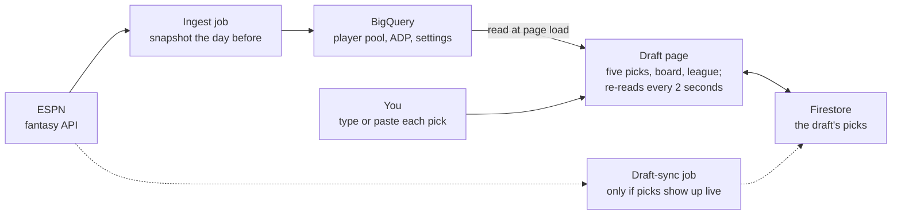

# Draft Tool: build proposal

*Proposal, October 6, 2026. Branch `DraftTool`, cut from `PointsLeague` at `bbcdf3e`;
rebased onto `multi-league` (with points leagues) on October 7.*

> **Built, October 7, 2026** (phases 1 and 2, the calibration and part of phase 3, for
> points leagues; how it works for users is in [draft-guide.md](draft-guide.md)). Not
> yet merged or deployed. How the build differs from this proposal:
>
> - **The goal is your team against theirs.** A pick isn't scored by your own roster's
>   points with a one-pick lookahead, but by your *expected wins a week once every
>   roster is full*: each candidate plays out the whole rest of the draft 200 times,
>   every team's later picks included, and the format compares the finished teams. So
>   a pick counts what he adds to you, what's likely left for you later, and whom he
>   keeps from the team that would have taken him.
> - **One engine for every format.** The draft state, opponent model, simulations and
>   recommendations know nothing about points (a test checks their imports). A format
>   supplies `strength`, `expected_wins`, `pick_value` and the ESPN rank its rooms draft
>   by (`app/draft/formats.py`); points reuses the points engine's fast estimate.
>   Categories mode is one more class and one branch in `draft/data.py::format_for`.
> - **The opponent model was fitted by replaying two real drafts** (DON FOOLIO and
>   Brooklyn, both categories): from many points mid-draft it predicted who'd still be
>   there 10 picks later. ESPN's ADP pools every format, and players whose categories
>   rank lagged their ADP slid in both rooms, so the board blends in the format's ESPN
>   rank (3/4 ADP + 1/4 rank). Brier score 0.124 (0.137 with ADP alone); a manager-level
>   "fade" and a room-level shift were tried and didn't help.
> - **Common random numbers**: every candidate is simulated on the same random draws,
>   so differences between picks are measured to about ±0.005 wins a week.
> - **Mock drafts are the practice mode** (bots are the fitted opponent model); live
>   drafts are typed, pasted, or pulled from ESPN on demand (public leagues), rather
>   than a polling job: phase 0's live check still needs a real draft.
> - **Not tied to any league** (changed the same day): leagues are registered after their
>   drafts, so the Draft page is a standalone mock draft anyone signed in can run at any
>   time. You enter the setup (teams, rounds, your position, lineup and point values,
>   ESPN's defaults filled in); players and the NBA schedule come from ESPN's
>   league-independent data; drafts are saved to your account and resume where you left
>   off. Typing every pick to follow a real draft elsewhere is still there. The daily
>   data pull keeps saving registered leagues' finished drafts, only to refit the
>   opponent model.
> - **Keepers, auction drafts, per-player projection overrides and the post-draft
>   report** aren't built yet.
> - **Measured:** with one seat drafting by the tool and the rest drafting like real
>   managers, the tool's team projected best in 10 of 10 drafts, by 107 points and 1.8
>   expected wins a week on average over the same seat drafting by ADP (scored by the
>   same projections it drafts with).

## Summary

The Draft Tool would be a live draft companion: open it beside ESPN's draft room, and at
every pick it suggests your five best picks. It tracks every team's roster as the draft
goes, so its advice weighs your team against the other 13. It starts with points leagues
and adds categories next.

- **At every pick:** five ranked suggestions, each with its reason (value, the chance
  he's gone by your next pick, the slot he fills) and what you'd likely get next if you
  take him.
- **Every team tracked:** rosters by slot, projected strength, remaining needs, and your
  rank in the league as it builds.
- **Works with any draft:** picks come in by fast manual entry or pasted from the draft
  room, because ESPN's API appears not to publish picks until a draft ends (see
  [Following the draft live](#following-the-draft-live)).
- **Practice first:** mock drafts against bots that pick like real managers, from ESPN's
  average draft positions (ADP).
- **Where it lives.** Branch `DraftTool`, cut from `PointsLeague` at `bbcdf3e`, holds
  this proposal only; no code yet. It needs League Lab plus PointsLeague's first two
  phases (the format lock and the points data); see
  [points-leagues.md](points-leagues.md).

## What you'd see on draft day

One page, built to sit beside ESPN's draft room on a laptop or a phone, that updates
within a second of each pick.

**Top strip:** "Round 3, pick 7 · You pick in 6 (#40)" or "You're on the clock", with the
pick-entry box right under it.

**Your five best picks,** one card each. What a card carries (the numbers are
illustrative):

| On the card | Example |
| --- | --- |
| Player, NBA team, eligible slots | Player 4 · F/C |
| Projected points | 38.4 FP/G × 71 games = 2,726 |
| Points above replacement | +612 for the season |
| Chance he's there at your next pick | 18% |
| Why now | "Biggest drop at F/C: the best one likely left at your next pick projects 6.1 FP/G lower" |
| If you take him | "Likely next for you: Player 9, Player 12 or Player 15" |
| Flags | Injury status, few games last season, rookie with no NBA stats |

**Tabs under the cards:**

- **Board:** every pick so far, rounds by teams, your column highlighted.
- **Available:** every undrafted player, sortable by the tool's rank, ESPN's rank or
  ADP, with search and slot filters like Player Rankings.
- **League:** every team's roster by slot, its projected weekly points and rank, and the
  slots it still needs.
- **My team:** your roster by slot, what's still open, and how you compare with the
  league average and the leader.

**Before the draft** you set your team and how much to avoid injury risk (avoid,
neutral, ignore), and can adjust any player's projection by hand. The draft order comes
from ESPN.

**On a phone** the cards stack, the board scrolls sideways, and the entry box stays
pinned at the top.

## Following the draft live

The tool can't count on reading picks from ESPN while a draft runs, so fast manual entry
is the core, and ESPN supplies everything before and after the draft.

| When | What ESPN gives (checked on your league's 2026-27 draft) | Used for |
| --- | --- | --- |
| Before | `draftSettings`: `type` SNAKE, `pickOrder` of 14 teams, `timePerSelection` 45 seconds, `keeperCount` 0, and the roster slots | The board, who's on the clock, your pick numbers |
| During | Probably no picks. A third-party ESPN draft tool reports the read API shows no picks and empty rosters until the draft ends ([espn-mcp](https://glama.ai/mcp/servers/HamCops/espn-mcp)), and `espn-api` skips picks until `drafted` is true | Nothing, unless phase 0 proves otherwise |
| After | `draftDetail.picks`: all 168 picks, each with `overallPickNumber`, `roundId`, `teamId`, `playerId` and `keeper` | Fixing entry mistakes; the post-draft report |

**Three ways to enter picks,** all writing to the same draft record:

1. **Type it.** One box, always focused. The team on the clock is filled in from the
   draft order. Type two or three letters and press Enter; a typo matches the closest
   available name. **Undo** takes back the last pick, and tapping a team changes who's
   on the clock (for traded picks).
2. **Paste to catch up.** Fell behind? Copy the pick list from ESPN's draft room and
   paste it. The tool finds the player names in order and fills in the missing picks.
3. **Live sync, if ESPN allows it.** Phase 0 polls ESPN's draft view during a real draft
   in a test league. If picks appear as they're made, a small job on the ingest side
   (where the ESPN cookies already live) polls every 5 seconds and writes them in. If
   not, a browser helper that reads the draft-room page is the fallback, weighed after
   phase 2.

**Built for the clock.** Your league gives 45 seconds a pick, and up to 26 picks fall
between your turns at the ends of the snake, so entering a pick has to take a few
seconds, one-handed.

**Shared and safe.** The draft lives in Firestore (`drafts/{league}-{season}`), so the
tool can be open on a phone and a laptop at once and a refresh loses nothing. While a
draft runs, the page re-reads it every 2 seconds.

**Keepers** come off the board before pick 1, from ESPN's keeper flags or entered by
hand.

**Mock drafts** use the same board with bots in the other seats. Bots pick the way the
opponent model in the next section predicts: ADP plus noise, steered by their needs. You
set how fast they pick.

## How the five picks are chosen in a points league

Each suggestion is the pick that leaves your roster strongest once you also count who's
likely to be left at your next pick. Four steps produce it:

1. **Projected points.** FP/G from ESPN's preseason projection under your league's
   scoring, which ESPN computes as `appliedAverage`. Games come from ESPN's projection,
   capped by each player's own last three seasons, so a player who misses 30 games a year
   isn't counted for 75. Season points = FP/G × games.
2. **Points above replacement (PAR).** Replacement level is what the best player left on
   waivers scores once every roster is full: about the 169th player in a 14-team,
   12-round draft. PAR = (FP/G − replacement) × games. A slot few players can fill, like
   your league's F/C, gets a higher replacement bar of its own.
3. **Who will be gone.** For each opponent pick until your next turn, the tool simulates
   who they take: ADP plus noise, steered by their needs, so a team with three centers
   rarely takes a fourth. 500 simulated runs give every player's chance of still being
   there. The noise is fitted to real drafts: how far actual picks strayed from ADP.
4. **Look one pick ahead.** For each of the top 30 candidates, the tool adds him to your
   roster, adds the best player you'd get at your next pick in each simulated run, and
   averages the result. The five highest are your five picks.

$$
\text{score}(X) = \frac{1}{N} \sum_{n=1}^{N} V\big(R + X + B_n(X)\big)
$$

Here R is your roster, Bₙ(X) the best player left for you at your next pick in run n if
you take X now, N = 500 runs, and V your roster's projected season points. At your last
pick the lookahead drops out and the score is V(R + X).

**Value is the whole roster, not one player.** V counts your best daily lineup in your
league's slots (2 G, 2 F, 1 F/C, 4 UT in yours), with bench players credited for the
games they'd fill in. That's why a fifth guard slides down the list even when his PAR is
high.

## Tracking every team

Every entered pick updates every team's roster, so the tool always knows each team's
strength, needs and likely next move, and where yours stands.

- **Rosters by slot.** Each team's players placed in its best lineup (G, F, F/C and UT
  starters, then bench), with empty slots shown as needs.
- **Fair comparison mid-draft.** Each team's projected weekly points so far, plus the
  expected value of its remaining picks from ADP at its pick numbers. A team that has
  picked less isn't ranked last just for that.
- **Your standing.** Your projected rank of 14 and the gap to first and to the middle,
  after every pick, with a bar per team and yours highlighted.
- **Needs feed the opponent model.** A team with no center is likelier to take one,
  which changes who's likely to be there at your pick.
- **Runs.** An alert when a slot is going fast: "4 F/C-eligible players in the last 6
  picks."
- **Head to head.** Pick any opponent to compare rosters slot by slot.

In a points league, strength means projected weekly points. In a categories league it
means the category profile and expected category wins, next section.

## Categories mode

Categories mode keeps the board, entry, opponent model and lookahead, and swaps the
value: a player is worth what he adds to your expected category wins against the other
13 projected rosters. Most of that math already runs the dashboard.

- **Player value:** z-scores from ESPN's projections, the dashboard's `projected` window
  in `v_player_z`.
- **Team value:** expected category wins E, out of 117 in a 14-team, 9-category league:
  every team's projected totals compared category by category, exactly as the Trade
  Analyzer does (`analysis/objective.py`).
- **Partial rosters:** each team's remaining picks are filled with the players expected
  at its pick numbers, so E compares full projected rosters at every point in the draft.
- **Punts:** after about 5 picks, the tool shows the categories you're unlikely to win
  and offers to punt them (FT% in a center-heavy build, for example). Punting re-weights
  every suggestion with the Trade Analyzer's Lock / Swing / Punt tiers.
- **Reasons in category terms:** "+3.5 category wins: passes 5 teams in BLK, 3 in REB."
- **ESPN's `ROTO` rank** sits beside the tool's rank, the way `STANDARD` does in points.

Your own league plays categories, so this is the mode you'd use in your next draft.

## Data needed before draft day

One ingest run the day before the draft loads everything the tool reads; every field
below was checked on your league's ESPN data.

| Data | From ESPN | Status |
| --- | --- | --- |
| Draft type, order, clock, keepers, date | `draftSettings`: `type`, `pickOrder`, `timePerSelection`, `keeperCount`, `date` | New `draft_settings` table |
| Roster slots | `rosterSettings.lineupSlotCounts` (yours: 2 G, 2 F, 1 F/C, 4 UT, 3 bench, 2 IR) | New, shared with PointsLeague |
| Point values | `scoringSettings.scoringItems` | From PointsLeague |
| Projections | Each player's projected 2026-27 split, with ESPN's `appliedAverage` under the league's scoring | Projections load today; applied points come with PointsLeague |
| Last season | The 2025-26 actual split | Loaded today |
| ADP and auction values | `ownership.averageDraftPosition`, `ownership.auctionValueAverage` | New columns on the player pool |
| ESPN's draft ranks | `draftRanksByRankType`: `STANDARD` (points) and `ROTO` (categories) | New columns on the player pool |
| Eligible slots, injuries | `eligibleSlots`, `injuryStatus` | Injuries load today; slots come with PointsLeague |
| Health history | Games played in past seasons | Loaded today (`player_seasons`) |
| Final picks | `draftDetail.picks` once the draft ends | New `draft_picks` table |

The picks themselves, as they're entered, live in Firestore rather than BigQuery: each is
a small write that has to reach every open screen within seconds.

## Build plan

The Draft Tool is one new page and a small `app/draft/` package: it reads a pre-draft
snapshot from BigQuery and keeps the live draft in Firestore.

Everything ESPN knows before the draft arrives the day before; during the draft, picks go
from you through the page into Firestore. The dashed job runs only if phase 0 shows ESPN
publishing picks during a draft.

| File | What it does |
| --- | --- |
| `app/pages/8_Draft.py` *(new)* | The page: top strip, pick entry, the five cards, the Board, Available, League and My team tabs, mock-draft controls |
| `app/draft/board.py` *(new)* | Draft state: snake order, keepers, traded picks, undo, paste matching, Firestore reads and writes |
| `app/draft/values.py` *(new)* | Projected points, games capped by health history, replacement levels by slot, PAR; projected z-scores for categories |
| `app/draft/opponents.py` *(new)* | The opponent model: ADP plus noise, steered by needs; the simulated runs |
| `app/draft/recommend.py` *(new)* | Roster value, the one-pick lookahead, the five picks and their reasons |
| `ingest/`, `sql/` | `draft_settings`, `draft_picks`, ADP, auction values and ESPN's ranks |
| `scripts/calibrate_draft.py` *(new)* | Fits the opponent model's noise from past drafts |
| `tests/app/test_draft.py` *(new)* | See Testing |

Phases, each shippable:

0. **Spike, a few hours.** Run a live draft in a throwaway ESPN league with autopick
   teams, poll the draft view every 5 seconds, and record whether picks appear live.
   Time 500 simulated runs.
1. **Board and mock drafts.** Values, PAR, ADP, the opponent model and mock drafts
   against bots; useful for practice right away.
2. **Live drafts.** Manual entry, paste, Firestore, the five picks and team tracking.
3. **Auto-sync or the browser helper,** whichever the spike points to.
4. **Categories mode.**
5. **Post-draft report.** Reconcile with ESPN's official picks, then grade every team and
   project the standings.

Before phase 1: League Lab launched, and PointsLeague's phases 1 and 2 done.

## Testing, timing, risks and open questions

Your league's real 2026-27 draft is the main test bed: all 168 picks are on ESPN, so the
opponent model can be checked against what actually happened.

**Testing**

- **Replay the real draft.** Players the model gave a 20% chance of lasting to a pick
  should have lasted about 20% of the time; the same check at every level of chance.
- **Bot drafts.** Thousands of simulated drafts with one seat using the tool and the rest
  drafting by ADP. The tool's team should finish with more projected points than an
  ADP-only drafter in most of them.
- **Units:** snake order with keepers and traded picks, undo, paste matching,
  replacement levels, roster value, and the lookahead on tiny hand-built pools.
- **Speed:** five picks back within 1 second of each entered pick.
- **Page tests** for entry, undo, paste and the phone layout.

**Timing**

- Your league's 2026-27 draft is already done (168 picks on ESPN), so the first real use
  is next fall.
- Most leagues draft before the NBA season tips off later this month, so this year's
  drafts end before phase 2 could ship. Phase 1's mock drafts work any time.

**Risks**

- **No live picks from ESPN.** If the spike confirms it, every pick is typed or pasted.
  With a 45-second clock that has to take seconds, so entry speed is a design target, not
  a detail.
- **Projection quality.** Suggestions are only as good as ESPN's projections; the
  per-player override lets you correct one you disagree with.
- **ADP mixes leagues.** ESPN's ADP pools many leagues and formats; fitting the model's
  noise on real drafts absorbs some of that.
- **Undocumented API.** ESPN can change these views without notice. The pre-draft
  snapshot means a mid-draft outage doesn't stop the tool.

**Open questions**

- [ ] Your league plays categories. Keep points first as planned, or build categories
  mode first for your next draft? Categories reuses the dashboard's z-scores, so it may
  be quicker.
- [ ] Auction drafts: out of scope at first? Your league drafts snake.
- [ ] Should the tool also run on your league's own site (main), or only in League Lab?
- [ ] Keepers and traded picks: needed in the first version?
- [ ] Is the post-draft report (phase 5) wanted?
