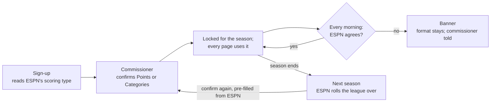

# Points leagues: build proposal

*Proposal, October 6, 2026. Branch `PointsLeague`, cut from `multi-league` at `f9d6071`.
No code yet.*

## Summary

PointsLeague would give League Lab a second engine, so head-to-head points leagues get
the same eight pages scored in fantasy points instead of categories. Each league's
format comes from its ESPN settings, is confirmed by the commissioner at sign-up, and is
locked for the season.

- **Why.** League Lab turns points leagues away today: `ingest/catalog.py` accepts only
  head-to-head category leagues.
- **What changes.** Every number built on categories gets a points version: player value
  (fantasy points per game over replacement), team strength (projected weekly points),
  the trade objective (expected wins a week), all-play, luck and projections.
- **What stays.** Sign-in, tenancy, the ingest fan-out, the precomputed-table pattern,
  every page's layout, and the search machinery behind Create a trade, Offer Builder and
  Mock trade.
- **The rule.** One format per league per season: confirmed at sign-up, fixed until the
  season ends, asked again at the next season's rollover.
- **Where it lives.** Branch `PointsLeague`, cut from `multi-league` at `f9d6071`, holds
  this proposal only; no code yet. It builds on League Lab's per-league settings, so it
  ships after League Lab launches. The Draft Tool needs its first two phases.

## How ESPN points leagues work

In a head-to-head points league every stat is worth a set number of points, and whoever
scores more points that week wins the matchup. One number decides each week instead of
nine category races.

ESPN's default values since 2020 are PTS 1, 3PM 1, FGM 2, FGA −1, FTM 1, FTA −1, REB 1,
AST 2, STL 4, BLK 4 and TO −2
([ESPN](https://www.espn.com.au/fantasy/basketball/story/_/id/30296896/espn-fantasy-default-points-league-scoring-explained)).
Leagues can change any value and score extras such as double-doubles, so the tool reads
each league's own values.

| | Category league | Points league |
| --- | --- | --- |
| **What decides a week** | Categories won (Most Categories or Each Category) | Total points |
| **A player's value** | z-scores per category, weighted by your needs | Fantasy points per game over replacement |
| **Team strength** | Category totals and ranks | Projected weekly points from a daily lineup |
| **Trade objective** | Category wins (E, out of 117) | Expected wins a week, all-play (out of 13) |
| **Strategy tiers** | Lock / Swing / Punt | None: a point counts the same everywhere |
| **What makes a deal win-win** | Category fit: each side gains where its races are close | Lineup fit: open spots, positions, games, health |

The last row shapes the Trade Analyzer most. A point is worth the same to every team, so
on paper most points trades are zero-sum; real gains come from how rosters are built.

**ESPN already computes the points.** Each stat window ESPN sends for a player (season,
last 7/15/30, projected) carries `appliedTotal` and `appliedAverage`: his fantasy points
under that league's scoring. `espn-api` reads them (`total_points`, `avg_points`,
`projected_avg_points`). The tool treats ESPN's numbers as the source of truth and uses
its own stat-by-stat math only for breakdowns and what-ifs.

## Choosing the format and locking it for the season

The format comes from ESPN, the commissioner confirms it at sign-up, and it stays locked
until the league's next ESPN season.

The daily check runs every morning; the rollover runs once a year, when ESPN starts the
league's next season.

- **Detect.** Registration already makes one no-login request to ESPN and reads
  `scoringType`. `H2H_POINTS` means Points; Most Categories or Each Category means
  Categories. Anything else (roto, season-total points) is refused with a plain reason,
  as now.
- **Confirm.** The registration preview spells out the choice: "This league plays
  head-to-head points. League Lab will run its points tools for the 2026-27 season, and
  the format can't change until next season." Only the registering commissioner
  confirms.
- **Store.** Firestore `leagues/{id}` gains `format`, `format_season`,
  `format_locked_at` and who confirmed. Every page, view and search reads the format
  from there.
- **Check daily.** Each ingest run compares ESPN's scoring type with the lock. On a
  mismatch it keeps the locked format and loads what it can, and the commissioner sees a
  banner; nothing switches silently.
- **Point values stay live.** Only the format is locked. Point values are re-read every
  run, so a commissioner's edit shows up the next morning.
- **Next season.** When ESPN rolls the league over, the commissioner confirms again,
  pre-filled from ESPN. Past seasons keep the format they were played in.
- **Mistakes.** Only the site owner can unlock mid-season, with a script that reloads
  that league's season in the other format.

**Why lock it.** Each format fills different tables and history. Switching mid-season
would leave half a season in the other format and change every number members have
already seen.

## Data changes

Points need five new kinds of data; everything else League Lab already loads, and no
category table or view changes.

| Data | From ESPN | New table or column | Used for |
| --- | --- | --- | --- |
| Point value per stat | `scoringSettings.scoringItems[].points` | `league_scoring`: league, season, stat, points | Breakdowns, what-ifs, the daily check |
| Each player's fantasy points per window | `appliedTotal` and `appliedAverage` on each stat window | `player_points`: league, player, window, total, per game, games | Player value, rankings, trades |
| Weekly team scores | Each matchup's `totalPoints` | `matchup_scores`: league, week, team, opponent, points | Standings, all-play, luck, projections |
| NBA schedule | The pro-team schedule (`espn-api` already fetches it for box scores) | `pro_schedule`: season, NBA team, date; shared by every league | Games per week, daily lineups |
| Lineup slots and eligibility | The league's lineup slot counts; each player's `eligibleSlots` | `league_settings.lineup_slots`, `player_details.eligible_slots` | The daily lineup simulation |

- **Stats.** ESPN's default scoring uses only stats League Lab already loads. Leagues
  that score extras (double-doubles, triple-doubles, technicals) still work, because
  ESPN's applied points include them; breakdowns show them as "Other".
- **ESPN is the source of truth.** Our sum of stat × points must match ESPN's applied
  average for every player and window within 0.1 points. Ingest logs any player who
  doesn't, which means a scoring rule was misread.
- **Views.** Six points views: `v_team_week_points`, `v_all_play_points`,
  `v_power_rankings_points`, `v_luck_points`, `v_player_points` and `v_roster_points`.
  Each covers points leagues only, so the precomputed `m_*` tables grow from ten to
  sixteen and each league fills only its own format's tables.
- **Per-slot scoring.** If a league's point values vary by lineup slot, the first
  version refuses it with a clear message.

## Points metrics

Every category metric gets a points stand-in, and most are simpler because one number
decides each week.

| Categories today | Points version | How it's computed |
| --- | --- | --- |
| z-scores per category | **Fantasy points per game (FP/G)** and **points above replacement (PAR)** | FP/G is ESPN's applied average. PAR is FP/G minus replacement level: the median FP/G of the 10 best healthy free agents in that window |
| Value to you (weighted by tiers) | **Lineup value** | How much your projected weekly points rise with him in your daily lineup; positions, games and roster crowding all count |
| General value (plain z total) | **Season PAR** | PAR × the games he's expected to play; the same for every team |
| Team category totals | **Projected weekly points** | A daily lineup simulation: each day, the best legal lineup from players with a game, using the league's slots and the NBA schedule |
| Category wins E (out of 117) | **Expected wins a week (out of 13)** | Each team's weekly points as a bell curve; the chance of beating each of the 13 others, added up (formula below) |
| Lock / Swing / Punt | **Points by source** | The share of a team's points from scoring, rebounds, assists, steals and blocks, threes, and the penalties for misses and turnovers, against the league average |
| All-play by categories | **All-play by points** | Each week, a team beats every team it outscored |
| Luck | **Luck** | Actual wins minus all-play expected wins, same idea as now |
| Projected finish | **Projected finish** | The remaining weeks simulated from each team's weekly points and spread, injury-aware like today |

Expected wins a week for team *i*, where μ is a team's projected weekly points and σ its
week-to-week spread:

$$
E_i = \sum_{j \neq i} \Phi\left(\frac{\mu_i - \mu_j}{\sqrt{\sigma_i^2 + \sigma_j^2}}\right)
$$

σ comes from the league's own weekly scores; early in the season, before there are
enough weeks, it starts from last season's spread. A trade's value is the change in E,
so "+0.4 wins a week" plays the role "+3 category wins" plays today.

## Page by page

Every page keeps its layout; what it measures changes, and Transactions doesn't change
at all.

| Page | In a points league |
| --- | --- |
| **Home** | Standings with W-L and points for and against; this week's scores |
| **Compare: Teams** | Weekly points side by side, points by source, per-game totals, lineup strength by slot |
| **Compare: Players** | FP/G, PAR, points by stat as stacked bars in place of the category radar, recent form in FP/G, health; the baseline is the average starter's FP/G at a position |
| **Power Rankings** | All-play by weekly points, points for, the injury-aware projected finish |
| **Matchups and Luck** | Weekly score cards with the margin; luck from all-play; most points scored in a loss |
| **Transactions** | Unchanged |
| **Roster Strength** | Teams ranked by projected weekly points, with points by source, strength by lineup slot, bench depth and games this week; no tiers |
| **Trade Analyzer** | Every tab scored in expected wins a week (next section) |
| **Player Rankings** | Ranked by FP/G or total points, with each stat's points and PAR as columns; same filters |

## Trade Analyzer, Offer Builder and Player Compare in points

The searches stay and only the scoring changes: each deal is judged by both teams'
change in expected wins a week, and the acceptance levels carry over (Win-win, Close
call, Max gain, with a lopsided check on season PAR).

**Where win-win deals come from.** Because a point is worth the same to every team, the
analyzer looks for gains in how rosters are built:

- **Consolidation.** In a 2-for-1, the team getting one player fills the open spot from
  waivers. Both teams gain when the waiver pickup adds more than the second player was
  adding.
- **Positions.** A team with three centers and no point guard leaves points on the
  bench; a swap can fix both lineups.
- **Games.** Players whose NBA teams play more games in the weeks that matter, the rest
  of the season or the playoffs.
- **Health.** Games each player is expected to miss, from his injury status and health
  history.

**Two-speed scoring.** The daily lineup simulation is too slow to run on every deal in a
search. Searches use a fast estimate (each player's FP/G × games, weighted by how often a
player at his place on the roster starts); the top deals, Mock trade and Compare then get
the full simulation. A test checks that the two rank deals alike.

| Tab | Points version |
| --- | --- |
| Team profile | Projected weekly points and rank, expected wins a week, strength by slot, games this week |
| Waiver wire | Adds and add/drop pairs ranked by expected wins a week |
| Trade finder | 1-for-1, 2-for-1 and 1-for-2 deals where both teams gain |
| Create a trade, Offer Builder | Same flows and limits (up to 3-for-3, the 250,000 guard), scored in expected wins |
| Mock trade | Weekly points and expected wins before and after, both lineups, step by step |

**Explanations and pitches** name where the gain comes from: "+0.4 wins a week: +9
points a week, mostly from starting a center on 3 more days." The pitch speaks to the
other manager's lineup the same way.

**Player Compare** shows points by stat instead of the category radar, and its "fit for
your team" becomes his lineup value for you. Consistency (a player's floor and ceiling
from game logs) can come later, once game logs are loaded.

## Build plan

Points is a second engine behind the same pages: each page asks the league's engine for
player values, team strength and deal scores, and only layout details check the format.

| File | Change |
| --- | --- |
| `ingest/catalog.py` | Accept `H2H_POINTS` and read point values; settle the Each Category name (see Risks) |
| `ingest/espn_client.py`, `ingest/transform.py` | Applied points per window, matchup scores, the NBA schedule, lineup slots, eligible slots |
| `sql/ddl/`, `sql/views/`, `ingest/materialize.py` | `league_scoring`, `player_points`, `matchup_scores`, `pro_schedule`; the six points views and their `m_*` tables |
| `app/league.py`, `app/tenancy.py`, `app/pages/register.py`, `app/pages/league_admin.py` | `format` on the league context; confirm and lock at sign-up; the rollover confirm; the mismatch banner |
| `app/formats/` *(new)* | `categories.py` wraps today's functions; `points.py` holds PAR, the lineup simulation, expected wins and the points explanations |
| `app/analysis/trades.py` | Searches take the engine's scoring function instead of calling `_category_changes` directly; category results unchanged |
| `app/pages/*` | Pages read values through the engine; points layouts for Roster Strength, Compare and Player Rankings |
| `scripts/set_format.py` *(new)* | The site owner's unlock-and-reload for a league registered with the wrong format |
| `tests/` | See Testing |

Phases, each ending with a review like League Lab's:

1. **Format and lock.** Detection, confirm, lock, daily check and rollover. Points
   leagues can register but see a "being built" page.
2. **Points data.** The new tables, views and `m_*` tables, plus the daily match against
   ESPN's applied points, checked first on a public league with no login.
3. **Standings pages.** Home, Matchups and Luck, Power Rankings, Player Rankings and
   Transactions.
4. **Strength pages.** Compare (Teams and Players) and Roster Strength.
5. **Trade Analyzer.** The engine split first, then Waiver wire, Trade finder, Create a
   trade, Offer Builder and Mock trade in points.
6. **Docs and launch.** Points sections in the site guide and metrics, and two or three
   real points leagues as testers.

Before phase 1, League Lab itself should be launched (its phases 1 to 3). The Draft Tool
needs phases 1 and 2 only.

## Testing, risks and open questions

ESPN's own fantasy points are the test oracle, and category leagues must come out
exactly as they are today.

**Testing**

- **ESPN as the oracle.** For every player and window, our stat-by-stat points match
  ESPN's applied average within 0.1. Weekly team scores come straight from ESPN.
- **A synthetic 4-team points league,** like today's fixture, for the engine: PAR, the
  lineup simulation on a fixed schedule, expected wins, deal scoring and explanations.
- **Lineups by hand.** Small cases with a known best lineup: position limits, players
  without a game, injured players.
- **Format lock.** Detect, confirm, refuse, lock, mismatch banner, rollover and the
  unlock script, against the in-memory Firestore League Lab's tests already use.
- **Category leagues unchanged.** Every existing test passes, and a category league's
  pages show the same numbers before and after.
- **Real leagues.** Two or three public points leagues registered on the live site
  before launch.

**Risks**

- **Size.** A second engine for every page: the largest job after multi-league itself.
- **Each Category name.** League Lab expects `H2H_EACH_CATEGORY`, but `espn-api`'s
  mapping (`basketball/box_score.py`) uses `H2H_CATEGORY` for Each Category. If ESPN
  sends `H2H_CATEGORY`, Each Category leagues are refused at sign-up today. Worth
  checking against a real league before League Lab launches, points or not.
- **Fast estimate drift.** If the searches' fast estimate ranks deals differently from
  the full simulation, the best deals can be missed; the test above watches for it.
- **Bonus scoring.** Double-double and triple-double bonuses exist only inside ESPN's
  totals, so breakdowns lump them as "Other".
- **Roto and season-total points** stay unsupported.

**Open questions**

- [ ] Can a league pick a format different from its ESPN scoring? *Recommendation: no;
  the choice is a confirmation, and a mismatch is refused.*
- [ ] Re-confirm every season, or carry the format over unless ESPN's scoring type
  changes? *Recommendation: re-confirm, pre-filled.*
- [ ] Headline number for points trades: expected wins a week (recommended) or points a
  week?
- [ ] Open the standings pages to points leagues as soon as phase 3 ships, or wait for
  all eight pages?
- [ ] Do you know points leagues willing to test?
