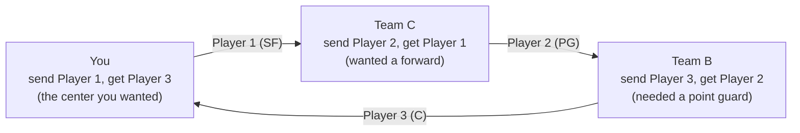

# Three-team trades: build proposal

*Proposal, October 6, 2026. Branch `3TeamTrade`, cut from `main` at `d4f6098`.*

> **Built, October 7, 2026** (phases 1-4 and the code for phase 5; not yet merged to main
> or deployed). How the build differs from this proposal:
>
> - **The search scores every deal exactly** instead of pair scores with a 2-win cushion.
>   The cushion could miss deals: a team's score against the other two changed teams can
>   move by more than 2. Each team's new totals are still built once per pair of
>   packages, and the three-way comparison runs vectorized over the whole grid, which is
>   fast enough: Unlock about 0.5 s, trade block about 0.4 s (0.8 s with a shortlist of 8)
>   on the 14-team league. The test "shortcut equals full search" became: the search
>   scores every deal exactly as simulating it alone does, and returns what checking each
>   deal one at a time finds.
> - **The guard counts deals, not pair scores:** 6,000,000 (`MAX_CIRCLE_DEALS`, about 1
>   s). Every setting the page offers fits on a 14-team league.
> - **Parity with two-team deals** is tested on the ESPN plan: the middle team's score
>   after trade 1 equals `simulate_trade` on that trade.
> - **The ESPN plan's in-between score uses players only**; roster moves are listed for
>   the finished deal, with a note when the middle team needs an open spot or is short.
> - **The balancing step** is a shared `fill_roster()` in `trades.py`; Offer Builder's
>   own vectorized version is unchanged.
> - **Open questions:** taken as recommended (on request only, the least-risk middle team,
>   packages of at most 2). The two new `league_status` columns need an `ALTER TABLE` on
>   the live dataset before the ingest job is deployed (see `sql/ddl/league_status.sql`).

## Summary

The 3TeamTrade branch would add three-team deals to the Trade Analyzer's Create a trade
tab. When the player you want sits on a team that wants nothing you have, the search
finds a third team that makes the deal work for all three.

- **What it is.** Three packages move around a circle: you send to Team C, Team C sends
  to Team B, and Team B sends you the player you want. Each team gives one package and
  gets one back.
- **Why build it.** Every search today pairs you with one partner. Plenty of targets land
  in *They'd likely say no* only because their manager needs something you don't have. A
  third team can supply it.
- **What it adds:**
  1. **Unlock a player**: pick the player you want and get circles that land him.
  2. **From my trade block**: Offer Builder's block, searched across every pair of
     partners.
  3. A deal card with all three sides, a pitch for each manager, and a plan for doing it
     on ESPN as two linked trades.
  4. A three-team Mock trade.
- **Where it lives.** Branch `3TeamTrade`, cut from `main` at `d4f6098`, holds this
  proposal only; no code yet. It starts from main because Offer Builder exists only
  there, and moves to multi-league with the next catch-up.

Follow the arrows from You: each team gets a package from one neighbour and sends one to
the other, so nobody has to want what you have except Team C. Each team is scored by its
own needs and punts; the deal is listed only if all three pass.

## What you'd see

Three-team deals get their own mode in Create a trade, next to Player you want and Offer
Builder, plus a shortcut from any target with no deal likely to work.

| Control | Choices | Default |
| --- | --- | --- |
| **Mode** | Unlock a player · From my trade block | Unlock a player |
| **Player you want** (Unlock) | Any healthy player on another roster, most valuable to you first | none |
| **Trade block** (block mode) | Up to 6 of your players, same picker as Offer Builder | none |
| **Partners** | Any two teams, or name one or two | Any |
| **Players per package** | 1 or 2 | 2 |
| **Acceptance** | Win-win · Close call · Max gain | Win-win |
| **Advanced** | Skip injured players you'd receive; partner shortlist size, 4 to 8 | On; 6 |

**Find three-team deals** returns up to 10 deals, at most 2 from any pair of partners.
Each deal card shows:

- **A headline**: your gain in category wins and whether all three teams gain, e.g. "+4
  for you · all three gain".
- **One row per team**: what it sends, what it gets, its change in category wins and the
  one-line reason ("passes 6 teams in BLK, 3 in REB"). A partner whose side looks
  lopsided is flagged.
- **How to do it on ESPN**: the recommended pair of trades and who carries the risk in
  between (see [Getting it done on ESPN](#getting-it-done-on-espn)).
- **Buttons**: Load into mock trade, Compare players, and copy-ready pitches for each
  manager plus one group message.

In Unlock mode, a line under the results shows the best two-team offer for the same
player ("Best two-team deal: +2, likely to work"). A three-team deal is listed only when
it beats that offer or when there isn't one, because two trades are harder to land than
one.

**Shortcut.** When Player you want finds fewer than 3 deals likely to work, a **Try a
three-team deal** button opens this mode with the player loaded.

**Nothing found?** As in Offer Builder, buttons try the next acceptance level or a longer
partner shortlist.

## How the search works

A deal is kept only if every team passes the test the two-team search already uses: its
own change in category wins, by its own weights and punts. What's new is that three
teams' totals change at once instead of two.

**Deal shapes.** Each package is 1 or 2 players. A pair of partners gives two circles, one
in each direction (You → B → C → You, or You → C → B → You). Unlock mode has one circle
per third team, because the target's team must send to you.

**Scoring each side.** Each team's new totals are compared with the 11 teams the deal
doesn't touch and with the other two teams' new totals. That gives each team's change in
category wins (E, out of 117). It's a three-team version of today's `_category_changes`.

**Rosters stay full,** by today's rule. A team left with extra players drops its
lowest-value remaining one. A team left short picks up the best available free agent, by
its own weights.

**Acceptance.** You must gain in every case, and both partners must pass the chosen
level:

| Level | Each partner's change in category wins | Lopsided deals |
| --- | --- | --- |
| Win-win | 0 or better | Hidden |
| Close call | −2 or better | Hidden |
| Max gain | No limit | Flagged |

*Lopsided* is today's test, applied to each partner: the general value it gives and gets
differ by more than 1.5.

**Ranking.** Deals sort by your gain. Ties go to the deal whose weaker partner gains more,
since that manager decides whether it happens; then to fewer players moved. A deal is
dropped when a version with one player fewer gains you as much (today's near-duplicate
rule).

**Keeping it fast.** Any two of 13 partners make 78 pairs, so 156 circles. With a
6-player block and full 13-player partner rosters, that's about 27 million package
combinations, far too many to score. Three steps cut it down:

1. **Shortlist.** In block mode, each partner offers its 6 most movable players: those
   worth less to their own team than in general (the Trade chips rule), skipping anyone
   OUT. In Unlock mode, the target's team sends the target alone or with one teammate,
   and the third team can send anyone.
2. **Score pairs, not triples.** A team's change depends on only two packages: the one it
   gets and the one it gives. So each team's side is scored for every pair of packages on
   its own, and pairs that miss by more than 2 category wins are dropped. The 2-win
   cushion covers how the three teams' changes affect each other.
3. **Join and rescore.** Keep circles where all three sides passed, then score those
   exactly, with all three teams changed together.

Before running, the search counts its pair scores and refuses anything over 250,000,
Offer Builder's limit, saying what to shrink. The usual searches fit:

| Search | Pair scores |
| --- | --- |
| Unlock a player, any third team | about 128,000 |
| From my trade block: 6 players, any two partners, shortlist of 6 | about 206,000 |

## Getting it done on ESPN

ESPN trades are between two teams; its help page only covers proposing a trade to one
team ([ESPN: trade proposals](https://support.espn.com/hc/en-us/articles/115003850391)).
So a three-team deal runs as two linked trades through a *middle team*, which makes both
trades while the other two make one each.

Any of the three can be the middle. For the circle in the Summary (you send Player 1 to
Team C, C sends Player 2 to Team B, B sends Player 3 to you):

| Middle team | Trade 1 | Trade 2 | Held in between |
| --- | --- | --- | --- |
| **You** | You ↔ C: you send Player 1, get Player 2 | You ↔ B: you send Player 2, get Player 3 | You hold Player 2 |
| **Team B** | B ↔ you: B sends Player 3, gets Player 1 | B ↔ C: B sends Player 1, gets Player 2 | B holds Player 1 |
| **Team C** | C ↔ B: C sends Player 2, gets Player 3 | C ↔ you: C sends Player 3, gets Player 1 | C holds Player 3 |

All three plans end with the same rosters; they differ in who is exposed if trade 2 falls
through. The card scores each plan's middle team after trade 1 alone and recommends the
plan where that team is hurt least, with the number ("If trade 2 falls through, Team B is
at −1 category win").

**Order.** Trade 2 can't be proposed until trade 1 has gone through, because the middle
team must own the player first. In a league with a review period, that's two reviews back
to back. The card warns when that would run past the trade deadline.

**Vetoes.** On ESPN, league members can vote against a trade if the league allows it
(same help page). A pass-through trade can look lopsided on its own, so the card flags
each trade that's lopsided alone, and the group message presents it as one three-team
deal.

**Roster limits.** When packages differ in size, a trade can leave a team over its roster
limit, and that manager has to drop someone to accept. The plan lists each trade's drops
and free-agent adds, using the search's balancing rule.

**New data.** The deadline and review-period checks need two ESPN settings the ingest
doesn't store yet: the trade deadline and the trade review hours. `espn-api` already reads
both (`trade_deadline`, `trade_revision_hours`), so `league_status` gains two columns.

## Mock trade, explanations and pitches

The Mock trade tab gets a **Teams in the deal: 2 | 3** switch. With 3, you pick two
partners and fill three boxes laid out around the circle: *You send to B*, *B sends to
C*, *C sends to you*. A **Reverse direction** switch flips the circle, and Load into mock
trade from a three-team card fills all of it.

- **Your moves work as now:** Add free agents, Drop players, the roster count and Suggest
  a pickup all apply to your side.
- **Partners' fill-in moves** (drops and free-agent adds from the balancing rule) are
  shown but not editable, to keep the screen manageable.
- **Results for all three teams:** category wins and matchup record now and after,
  category ranks before and after, and per-game totals, one block per team. Step by step
  keeps your rows: Now, Deal only, Deal + your moves.
- **The ESPN plan:** the three middle-team options, each with trade 1, trade 2 and the
  in-between score.
- **Health and games played** for every player in the deal, as now.

**Explanations.** Each team's row reuses today's one-line reason ("passes 6 teams in BLK,
3 in REB; costs 2 teams in FT%").

**Pitches.** Each partner gets today's pitch written from their side ("This helps you in
AST, 3PM: you'd pass 2 teams in AST…"). A new **group message** covers the whole circle in
one post, for example:

> Three-team idea: I get Player 3, Team C gets Player 1, Team B gets Player 2. Team B, it
> helps your AST and FT%. Team C, it helps your 3PM and STL. Easiest order: B and I trade
> first, then B sends Player 1 to C for Player 2.

**Compare players** opens Compare with the deal's players: all 3 in a one-player circle,
the first 4 when packages hold two (Compare's limit, as in Offer Builder).

## Build plan

The new search lives in its own module, reuses the two-team scoring pieces, and leaves
today's searches untouched.

| File | Change |
| --- | --- |
| `app/analysis/three_team.py` *(new)* | Circle search: packages, shortlists, pair scoring, the join, exact three-team rescoring, roster balancing, acceptance, ranking, near-duplicates, caps, the 250,000 guard, and `middle_plans()` for the ESPN order |
| `app/analysis/trades.py` | The balancing step (drop the lowest, add the best free agents) moves out of `_offers_with` into a helper both searches share; behaviour unchanged |
| `app/analysis/explain.py` | `group_pitch()` for the one-post message; `explain()` and `pitch_text()` reused per team |
| `app/analyzer.py` | Cached `three_team_for_target()` and `three_team_offers()`, keyed on plain values like `offers()` |
| `app/pages/6_Trade_Analyzer.py` | Create a trade: the three-team mode, its card and the shortcut. Mock trade: the 2 / 3 switch, three boxes, three-team results |
| `ingest/`, `sql/ddl/league_status.sql` | Two new columns: trade deadline and trade review hours |
| `tests/app/test_analysis.py` | The tests below; the synthetic 4-team league already has enough teams |
| `docs/` | Trade Analyzer guide, site guide and metrics: three-team mode, the ESPN plan, middle-team risk |

**Reused as is:** `weights_by_team`, `player_values`, `generic_values`, `category_wins`,
`head_to_head`, `LOPSIDED_GAP`, `CLOSE_CALL_FLOOR`, `MAX_SEARCH_DEALS`, `SearchTooLarge`
and `compare_players`. `load_into_mock` gains a second partner.

Phases, each shippable on its own:

1. **Engine and tests.** `three_team.py` with no page changes. Done when the shortcut
   search matches a full search on small leagues.
2. **Unlock a player.** The smaller search and the main use: mode, card, ESPN plan, and
   the shortcut from Player you want.
3. **From my trade block.** Shortlists, the any-two-partners search and the guard
   message.
4. **Three-team Mock trade.**
5. **Ingest columns, docs, then push and deploy to main.**

## Testing and performance targets

The key test is that the fast three-step search finds exactly what checking every
combination finds; the rest pin down scoring, balancing and the ESPN plan.

**Unit tests** on the synthetic 4-team league:

- **Shortcut equals full search.** On small random leagues, the three-step search returns
  the same deals as scoring every combination.
- **Parity with two-team deals.** A circle with one empty package is really a two-team
  deal, so its scores must match `simulate_trade` exactly.
- **Acceptance.** A planted circle where all three gain is found. Make one partner lose
  and it drops out at Win-win, stays at Close call within −2, and is flagged at Max gain.
- **ESPN plans.** All three middle-team plans end with the same rosters, and each
  in-between score is right.
- **Balancing.** Uneven packages (2 for 1) drop and add like the two-team rule.
- **Guard, near-duplicates and caps.** The guard raises before any work when the count is
  over 250,000; near-duplicates go; at most 2 deals per pair of partners.

**Real data,** run as page tests like the last features: both modes on several targets
and trade blocks, the shortcut button, the three-team Mock trade, and a smoke test of
every page.

**Speed targets** on the live 14-team league, first run; results are then cached for an
hour like the other searches:

| Search | Target |
| --- | --- |
| Unlock a player | Under 1 second |
| From my trade block, any two partners | Under 3 seconds |
| Three-team Mock trade | Under 0.5 seconds |

## Risks, limits and open questions

The biggest risk is execution, not math: a three-team deal needs two accepted trades, and
the middle team can get stuck in between.

- **Two trades, not one.** Both must be accepted, and both may sit through a review
  period. The card shows how badly the middle team is hurt if trade 2 falls through.
- **Three managers to convince.** The tool writes the pitches; it can't send them.
- **Same model limits as two-team deals.** It counts category wins, not loyalty, playoff
  plans or hunches.
- **Shortlists can miss deals.** Block mode looks at only 6 players per partner, so deals
  built around a partner's core players are skipped. Advanced raises the shortlist to 8.
- **Bigger leagues are slower.** More teams or longer rosters mean more pairs; the guard
  stops a slow search and says what to shrink.

**Open questions**

- [ ] Should three-team deals also show up in the Trade finder unprompted, or only on
  request in Create a trade? *Recommendation: on request only, at first.*
- [ ] Recommend the least-risk middle team, or default to you as the middle so you
  control both trades?
- [ ] Allow 3-player packages? *Recommendation: no; 2 keeps the search fast and the deal
  easy to explain.*
- [ ] Can your commissioner push a pre-agreed three-team deal through directly? If so,
  the plan can offer that route.
- [ ] Port to multi-league right after main ships, or with the next catch-up?
